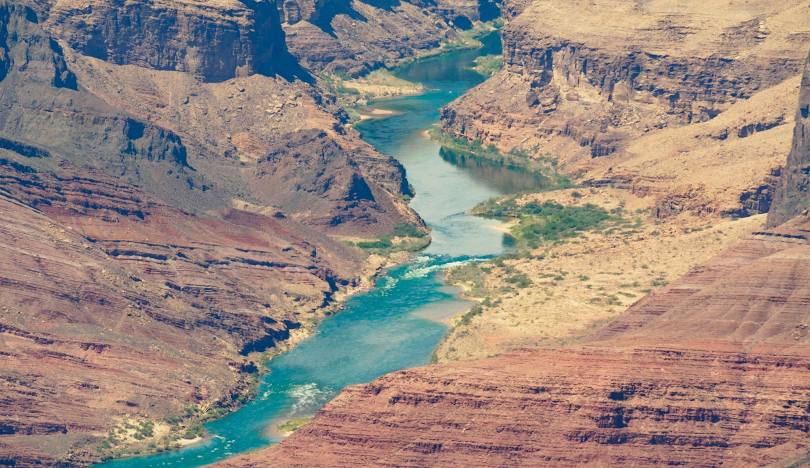

```{r}
#| include: false
knitr::opts_chunk$set(
  fig.width  = 8,
  message    = FALSE,
  warning    = FALSE,
  comment    = "",
  cache      = FALSE,
  fig.retina = 3
)
```

```{r}
#| echo: false
#| fig-align: center
#| out-width: "100%"

```

In January 2023, the federal government announced the first-ever Tier 3 shortage on the Colorado River — triggering mandatory cuts to Arizona, Nevada, and Mexico. Those cuts were calculated from streamflow records like the ones you are about to pull.

The Colorado River Basin supplies drinking water to 40 million people across 7 US states, irrigates 5 million acres of farmland, and is governed by one of the oldest and most contested water rights agreements in American history — the Colorado River Compact of 1922. Understanding how streamflow varies across this system is not an academic exercise. It is the daily work of water managers, federal agencies, tribal water rights holders, and scientists navigating a river under compounding stress from drought, overallocation, and climate change.

In this lab you will work with real streamflow records pulled directly from the **USGS National Water Information System (NWIS)** — the same federal system water managers query every morning. You will build a complete analytical pipeline: from raw API call to normalized comparisons, threshold detection, basin-wide trend visualization, and a predictive model of the Compact's key accounting point.

------------------------------------------------------------------------

## Libraries

```{r}
#| eval: true
if (!requireNamespace("pacman", quietly = TRUE)) install.packages("pacman")

pacman::p_load(
  tidyverse,
  dataRetrieval,
  zoo,
  patchwork,
  flextable,
  lubridate,
  broom,
  tibble
)
```

## Data

We will use the `dataRetrieval` package — developed and maintained by the USGS — to pull 44 years of daily mean discharge from 7 long-record gauges spanning the Colorado River's main stem and major tributaries.

```{r}
#| label: data-pull
#| cache: true

gauges <- tibble::tribble(
  ~site_no,     ~name,                           ~state,
  "09380000",   "Colorado R at Lees Ferry",      "AZ",
  "09163500",   "Colorado R near CO-UT border",  "CO",
  "09085000",   "Colorado R at Glenwood Springs","CO",
  "09306500",   "White R near Watson",           "UT",
  "09379500",   "San Juan R near Bluff",         "UT",
  "09402500",   "Little Colorado R near Cameron","AZ",
  "09423000",   "Colorado R below Hoover Dam",   "NV"
)

raw <- readNWISdv(
  siteNumbers = gauges$site_no,
  parameterCd = "00060",
  startDate   = "1980-01-01",
  endDate     = "2023-12-31"
) |>
  renameNWISColumns() |>              # renames X_00060_00003 → Flow
  left_join(gauges, by = "site_no") |>
  select(site_no, name, state, Date, Flow)

glimpse(raw)
```

------------------------------------------------------------------------

# **Question 1**: Daily Conditions Report {#q1}

You are a water resources analyst. Each morning you deliver a reproducible snapshot of current conditions to Colorado River Compact stakeholders. The analysis must be re-runnable on any date with a single change — that requires building it around **parameter objects** rather than hardcoded values.

```{r}
my.date <- as.Date("2023-09-30")
class(my.date)
```

```{r}
daily_discharge <- raw |> 
  group_by(site_no) |> 
  arrange(Date, .by_group = TRUE) |> 
  mutate(flow_delta = Flow - lag(Flow))
```

```{r}
date_discharge <- daily_discharge |> 
  filter(, Date == my.date)

#Table 1
table_1 <- date_discharge |> 
  ungroup() |> 
  slice_max(Flow, n=5) |>
  select(-Date,-flow_delta)

flextable(table_1) |> 
  set_header_labels(
    site_no = "Site Number",
    name = "Gauge",
    state = "State",
    Flow = "Discharge (cfs)") |> 
  set_caption("Table 1. Gauges with the top five discharges on September 30, 2023") |>
  autofit()

#Table 2
table_2 <- date_discharge |> 
  ungroup() |> 
  slice_max(flow_delta, n=5) |> 
  select(-Date)

flextable(table_2) |> 
  set_header_labels(
    site_no = "Site Number",
    name = "Gauge",
    state = "State",
    Flow = "Discharge (cfs)",
    flow_delta = "Change in Discharge (cfs)")|> 
  set_caption("Table 2. Gauges with the greatest day-over-day increases in discharge on September 30, 2023") |>
  autofit()
```

------------------------------------------------------------------------

# **Question 2**: Basin Metadata Join {#q2}

Raw discharge numbers alone don't tell the full story. Lees Ferry always carries more water than the San Juan at Bluff — but that is largely because it drains over **111,000 square miles** versus the San Juan's \~23,000.

```{r}
#| label: site-meta
#| cache: true

site_meta <- readNWISsite(gauges$site_no) |>
  select(
    site_no,
    drain_area_va,   # drainage area in square miles
    huc_cd,          # 8-digit HUC watershed code
    dec_lat_va,      # latitude
    dec_long_va      # longitude
  )

# Is site_no actually unique? If any row shows n > 1, the join will duplicate rows
site_meta |> count(site_no) |> filter(n > 1)
```

```{r}
joined <- raw |> 
  left_join(site_meta, by = "site_no")
```

```{r}
nrow(joined) == nrow(raw)

sum(is.na(joined$drain_area_va)) == 0
sum(is.na(joined$huc_cd)) == 0
sum(is.na(joined$dec_lat_va)) == 0
sum(is.na(joined$dec_long_va)) == 0

joined |> 
  filter(site_no == "09085000") |> 
  distinct(drain_area_va)
```

# **Question 3**: Per-Unit-Area Normalization {#q3}

Lees Ferry's high discharge reflects its enormous watershed, not necessarily more intense rainfall or runoff. To compare **runoff intensity** across sites with different drainage areas, we normalize by expressing flow per unit area: cfs per square mile.

```{r}
joined <- joined |> 
  mutate(flow_per_sqmi = Flow/drain_area_va)
```

```{r}
#raw rank uses Flow; normalized rank uses flow_per_sqmi
date_joined <- joined |> 
    filter(, Date == my.date) |> 
    mutate(flow_per_sqmi = round(flow_per_sqmi,2)) |> 
    mutate(raw_rank = rank(-Flow)) |> 
    mutate(normalized_rank = rank(-flow_per_sqmi)) |> 
    select(name, Flow, drain_area_va, flow_per_sqmi,raw_rank,normalized_rank) |> 
    arrange(raw_rank)

flextable(date_joined) |> 
  set_header_labels(
    name = "Gauge Name",
    Flow = "Raw Discharge (cfs)",
    drain_area_va = "Drainage Area (mi²)",
    flow_per_sqmi = "Normalized Flow (cfs/mi²)",
    raw_rank = "Raw Rank",
    normalized_rank = "Normalized Rank") |> 
  set_caption("Table 3. Raw and normalized rank of discharge by drainage area on September 30, 2023") |>
  autofit()
```

**c.** Answer in 2–3 sentences: (1) do the raw and normalized rankings differ, and if so, which gauge changes most dramatically? (2) Why does per-area normalization matter for comparing gauges in the Colorado Basin? (3) Name one analysis where you would use raw discharge and one where you would use normalized discharge.

The rankings do differ for all but one gauge and the most drastic change occurs at two gauges, where the rankings jump from 1 for raw to 5 for normalized for the Little Colorado River near Cameron and they change from 5 for raw to 1 for normalized at the Colorado River at Glenwood Springs. Per-area normalization of discharge at these gauges is important because this allows us to compare flow within different sized basins. Raw discharge would be useful when analyzing one basin/catchment/etc while normalized discharge is useful when analyzing multiple basins.

> ...

------------------------------------------------------------------------

# **Question 4**: Low-Flow Threshold Monitoring {#q4}

Drought managers don't just watch absolute flow levels — they watch how current conditions compare to **historical norms**. The standard operational metric is the **7Q10**: the lowest 7-day average flow expected to occur once in 10 years. We'll use a related approach: flag when the 7-day rolling mean falls below the historical 10th percentile.

```{r}
low_discharge <- joined |> 
  group_by(site_no) |> 
  mutate(roll_mean = rollmean(Flow, k=7, fill = NA, align = "right"))
```

```{r}
low_threshold <- low_discharge|> 
  filter(between(Date, as.Date("1980-01-01"), as.Date("2010-12-31"))) |> 
  group_by(site_no) |> 
  mutate(low_flow_threshold = quantile(Flow, 0.10)) |> 
  ungroup()
```

```{r}
low_threshold <- low_threshold |> 
  mutate(below_threshold = roll_mean < low_flow_threshold)
```

```{r}
low_threshold_L <- low_discharge|> 
  filter(site_no == "09380000") |> 
  filter(between(Date, as.Date("2000-01-01"), as.Date("2023-12-31"))) |> 
  mutate(low_flow_threshold = quantile(Flow, 0.10), na.rm = TRUE) |> 
  ungroup()

low_threshold_L <- low_threshold_L |> 
  mutate(below_threshold = roll_mean < low_flow_threshold)

lees_threshold <- low_threshold_L |> 
  pull(low_flow_threshold)

ggplot(low_threshold_L, aes(x = Date, y = roll_mean))+
  geom_ribbon(aes(ymin = ifelse(below_threshold, roll_mean, lees_threshold), 
                         ymax = lees_threshold), fill = "red", alpha = 0.5)+
  geom_hline(yintercept = lees_threshold, linetype = "dashed", color = "black")+
  labs(title = "Figure 1. Lees Ferry (09380000) 7-Day Rolling Mean Discharge Between 2000-2023",
       x = "Date", y = "7-Day Rolling Mean (cfs)")
```

**e.** How many days per year, on average, did Lees Ferry fall below its low-flow threshold in **2000–2010** vs. **2011–2023**? Produce a small summary table and answer in 2–3 sentences: (1) did below-threshold days increase or decrease? (2) Is this a shift in isolated dry years or a persistent baseline change? (3) What does this imply for Compact delivery obligations?

```{r}
low_threshold_L |>
  mutate(date_range = case_when(Date <= as.Date("2010-12-31") ~ "2000–2010",
                                Date >= as.Date("2011-01-01") ~ "2011–2023")) |> 
  filter(!is.na(date_range), !is.na(below_threshold)) |> 
  group_by(date_range) |> 
  summarize(years = n_distinct(year(Date)),
            total_days = sum(below_threshold, na.rm = TRUE),
            avg_days_year = round(total_days / years, 0)) |> 
  flextable() |> 
  set_header_labels(date_range = "Date Range",
    years = "Years",
    total_days = "Total Below-Threshold Days",
    avg_days_year = "Avg Days/Year Below Threshold") |> 
  set_caption("Table 4. Lees Ferry (09380000) Low-Flow Days: 2000–2010 vs. 2011–2023") |> autofit()

#The number of average days per year below the threshold level at Lees Ferry decreased in the 2011-2023 timeframe, indicating that overall yearly flow was higher in this period. When compared to Figure 1, it appears that this trend appears to be isolated to dry years which are more persistent in the past 5 years. This indicates that as we continue to face dry years, the delivery obligations of the Compact will not be met which is a main consideration addressed in the draft EIS published by the Bureau of Reclamation (Hite et al. 2026).

#Citation: Hite, Kristen, Sheikh, P., & Stern, C. (March 2026).Management of the Colorado River: Water Allocations, Drought, and the Federal Role. https://www.congress.gov/crs-product/R45546 
```

------------------------------------------------------------------------

# **Question 5**: Annual Water Year Summary {#q5}

Calendar years are a poor fit for western US hydrology. The **water year** (October 1 – September 30) captures the full snowmelt cycle: snowpack accumulates through winter, melts in spring, and by September the basin has recharged or drawn down for the year. Water year 2023 = October 1, 2022 through September 30, 2023.

```{r}
low_threshold_wy <- low_discharge|>
  mutate(low_flow_threshold = quantile(Flow, 0.10, na.rm = TRUE)) |> 
  mutate(below_threshold = roll_mean < low_flow_threshold) |> 
  mutate(month = month(Date)) |> 
  mutate(water_year = if_else(month >= 10, year(Date) +1, year(Date)))
```

```{r}
water_year <- low_threshold_wy |> 
  group_by(site_no, water_year) |> 
  summarize(annual_flow = sum(Flow, na.rm = TRUE),
            peak_daily_flow = max(Flow, na.rm = TRUE),
            days_below_threshold = sum(below_threshold, na.rm = TRUE))
```

```{r}
wy_plot <- water_year|> 
  filter(site_no == "09380000")

wy_median <- median(wy_plot$annual_flow, na.rm = TRUE)

wy_plot |> 
  mutate(above_median = annual_flow >= wy_median) |> 
  ggplot(aes(x = water_year, y = annual_flow, fill = above_median))+
  geom_col()+
  geom_hline(yintercept = wy_median, linetype = "dashed", color = "black")+
  scale_fill_manual(values = c("TRUE" = "blue", "FALSE" = "red"),
                    labels = c("TRUE" = "Above Medain", "FALSE" = "Below Median"),
                    name = "Annual Discharge")+
  labs(title = "Figure 2. Lees Ferry (09380000) Annual Discharge by Water Year",
       x = "Water Year", y = "Annual Discharge (cfs)")
```

In 2–3 sentences: (1) describe the direction and approximate timing of any structural shift in the record, (2) identify one year that stands out as an exception to the dominant pattern and what you know about its cause, and (3) explain what this pattern means for Compact water accounting.

Figure 2 depicts a negative trend in flow values, especially when analyzing at above median flow years. The 2011 flow year defies this pattern as it reached similar flow levels to those from before 2000. When analyzing the USGS gauge discharge data for this year, it appears that the peak correlates with snowmelt from high snowfall season, similar to that of 1984 (Martellaro 2011). Though these spikes momentarily help supply the Colorado River, they are not the overall trend and water accounting for the Compact will be dealing with continued below median years in the future.

Citations:

Martellaro, A. (September 2011). *2011 State Annual Report*. Colorado Division of Water Resources. https://spl.cde.state.co.us/artemis/nrserials/nr520internet/nr5202011internet.pdf

U.S. Geological Survey Water Data for the Nation. *Colorado River at Lees Ferry, AZ*. Colorado River at Lees Ferry, AZ - USGS Water Data for the Nation. https://waterdata.usgs.gov/monitoring-location/USGS-09380000/#dataTypeId=continuous-00065--1212571048&showFieldMeasurements=true&startDT=2010-10-01&endDT=2011-09-30

> ...

------------------------------------------------------------------------

# **Question 6**: Basin-Wide Trend Analysis {#q6}

A single gauge tells you about one location. To understand whether drought is consistent across the entire basin — or whether some tributaries are diverging from the main stem — you need to compare all gauges simultaneously on the same scale.

Raw discharge can't serve this purpose: a large-watershed gauge will always dominate. The solution is a **standardized anomaly** — each year's flow expressed as standard deviations above or below the site's own baseline mean:

$$\text{anomaly} = \frac{\bar{Q}_{year} - \bar{Q}_{baseline}}{\sigma_{baseline}}$$

where baseline = 1980–2010. An anomaly of –2 means "two standard deviations below normal for this gauge" — directly comparable to the same metric at any other gauge.

```{r}
baseline <- water_year |> 
  filter(water_year < 2011) |> 
  group_by(site_no) |> 
  summarize(baseline_mean = mean(annual_flow),
            baseline_sd = sd(annual_flow))

water_year <- water_year |> 
  left_join(baseline, by = "site_no") |> 
  mutate(sd_anomaly = (annual_flow - baseline_mean)/baseline_sd)

sum(is.na(water_year$baseline_mean))
sum(is.na(water_year$sd_anomaly))
```

```{r}
water_year |> 
  left_join(gauges, by = "site_no") |> 
  filter(water_year < 2011) |> 
  ggplot(aes(x = water_year, y = name, fill = sd_anomaly))+
  geom_tile(color = "black")+
  scale_fill_distiller(palette = "RdBu",
                       direction = 1,
                       oob = scales::squish,
                       name = "SD Anomaly")+
  labs(title = "Figure 3. Standardized Anomaly By Stream Gauge",
       x = "Water Year",
       y = "Gauge Name")+
  scale_y_discrete(labels = ~str_wrap(.x, width = 15))
```

**c.** In 3–4 sentences: (1) describe whether the post-2000 drought signal appears across all gauges or only some, (2) identify two specific years that appear as basin-wide anomalies — one dry, one wet — and name the climate event that caused each, and (3) explain what simultaneous basin-wide anomalies tell you that a single-gauge record cannot.

The post-2000 drought signal appears strong across most gauges with slight deviations into positive values for one year at the Colorado River at Glenwood Springs, the Colorado River near the CO-UT border, and the San Juan River near Bluff. There is a basin-wide anomaly early on in the data from 1983 to 1984 in which there was a large snow year, as mentioned in my response for question 5c, with 150% of the normal snowfall ( Doesken & McKee 1985). Evaluating anomalies at a basin-wide scale allows you to understand if the anomaly is global or centralized to one gauge and gives more insight into climate impacts.

Citation:

Doesken, N., & McKee, T. (1985, February). *Colorado Climate Summary Water-Year Series (Oct 1983 - Sept 1984)*. Colorado Climate Center. https://climate.colostate.edu/pdfs/WaterYearSeries_85_1.pdf

> ...

------------------------------------------------------------------------

# **Question 7**: The Moving Center of Drought {#q7}

You have been asked to understand how the *geographic center* of streamflow has shifted over time. If drought has disproportionately reduced flow in the southern tributaries, the flow-weighted center of the basin should drift north — proportionally more flow is coming from northern headwater gauges. In exceptional snowmelt years it should shift back.

We measure this with the **flow-weighted mean position**: each gauge's coordinates are weighted by its fraction of total annual basin flow.

$$\bar{X}_{year} = \frac{\sum (lon_i \times Q_i)}{\sum Q_i} \qquad \bar{Y}_{year} = \frac{\sum (lat_i \times Q_i)}{\sum Q_i}$$

```{r}
geo_flow <- water_year |> 
  left_join(site_meta |> 
              select(site_no, dec_lat_va, dec_long_va),
            by = "site_no")

nrow(geo_flow)
sum(is.na(geo_flow$dec_lat_va)) == 0
sum(is.na(geo_flow$dec_long_va)) == 0

weighted_geo_flow <- geo_flow |> 
  group_by(water_year) |> 
  summarize(weighted_lat = sum(dec_lat_va*annual_flow)/sum(annual_flow),
            weighted_long = sum(dec_long_va*annual_flow)/sum(annual_flow))
```

```{r}
states <- map_data("state") |> 
  filter(region %in% c("arizona","colorado", "nevada", "new mexico","utah"))

left_plot <- ggplot()+
  geom_polygon(data = states,
               aes(x = long, y = lat, group = group),
               fill = "grey", color = "white") +
  geom_path(data = weighted_geo_flow,
            aes(x = weighted_long, y = weighted_lat, color = water_year),
            linewidth = 0.5) +
  geom_point(data = weighted_geo_flow,
             aes(x = weighted_long, y = weighted_lat, color = water_year),
             size = 1.5) +
  scale_color_gradient(low  = "blue", high = "red", name = "Water Year") +
  labs(title = "Weighted Center By Water Year",
       x = "Longitude",
       y = "Latitude")

right_plot <- ggplot(weighted_geo_flow, aes(x = water_year, y = weighted_lat)) +
  geom_line(color = "grey", linewidth = 0.5) +
  geom_point(aes(color = water_year), size = 1.5) +
  geom_smooth(method = "lm", se = TRUE, color = "black", linewidth = 0.5) +
  scale_color_gradient(low  = "blue", high = "red", name = "Water Year") +
  labs(title = "Weighted Mean Latitude By Water Year",
       x = "Water Year",
       y = "Weighted Mean Latitude")
  
left_plot + right_plot
```

**c.** Your latitude time series should show two years where the weighted center spikes dramatically northward. Identify those two years and explain: (1) what climate event caused each spike, (2) what they have in common physically, and (3) what the long-term upward trend in weighted latitude suggests about which part of the basin is becoming proportionally more important to total flow — and why that matters for water managers downstream.

There are spikes in 1993 and 2023 on the time series graph which correlate with years that had larger snowpacks than normal conditions due to el nino patterns (McKinnon 1993) (NRCS 2023). Both years have spikes coming off of below or at average values indicating that the weighted centers are shifting to be higher in latitude. As a long-term trend, this indicates that gauges higher in the basin will continue to increase in importance for water supply within the basin.

Citations:

McKinnon, S. (1993, May). *Colorado Snowpack Melting*. USBR. https://www.usbr.gov/lc/hooverdam/museum/clippings/clipart1768.pdf

USDA NRCS (2023, January). *Colorado snowpack starting 2023 at above normal levels in most major basins*. USDA Natural Resources Conservation Service. https://www.nrcs.usda.gov/state-offices/colorado/news/colorado-snowpack-starting-2023-at-above#:\~:text=\*%20Denver%2C%20CO%20–%20January%206th%2C%202023,Reservoir%20Storage%20as%20of%20January%201st%2C%202023. 

> ...

------------------------------------------------------------------------

# **Question 8**: Seasonal Regimes and Peak Timing {#q8}

Annual totals mask important seasonal structure. The Colorado Basin has two distinct runoff pulses: a **snowmelt** surge in spring (April–June) driven by Rocky Mountain headwater snowpack, and a **monsoon** pulse in late summer (July–September) driven by convective storms across the Arizona-New Mexico plateau. These seasons respond differently to climate forcing — and under warming, the snowmelt season is arriving earlier.

Roughly we will define the seasons as follows:

-   **Snowmelt**: April–June (months 4–6)
-   **Monsoon**: July–September (months 7–9)
-   **Low-flow**: October–December (months 10–12)
-   **Winter**: January–March (months 1–3)

```{r}
seasonal_flow <- joined |> 
  mutate(month = month(Date),
         season = case_when(
           month %in% 4:6 ~ "Snowmelt",
           month %in% 7:9 ~ "Monsoon",
           month %in% 10:12 ~ "Low-flow",
           month %in% 1:3 ~ "Winter"),
         season = factor(season, levels = c("Snowmelt", "Monsoon", "Low-flow", "Winter")))
```

```{r}
seasonal_discharge <- seasonal_flow |> 
  mutate(water_year = if_else(month >= 10, year(Date) +1, year(Date))) |> 
    group_by(site_no, water_year, season) |> 
  summarize(seasonal_flow = sum(Flow),
            seasonal_normalized = sum(flow_per_sqmi),
            .groups = "drop")
```

```{r}
peak_mean <- joined |> 
  mutate(water_year = if_else(month(Date) >= 10, year(Date) +1, year(Date))) |> 
  group_by(site_no, water_year) |> 
  mutate(roll7 = rollmean(Flow, k =7, fill = NA, align = "right")) |> 
  slice_max(roll7, n=1, with_ties = FALSE) |> 
  mutate(peak_day = yday(Date))

peak_mean |> 
  filter(site_no == "09380000") |> 
  ggplot(aes(x = water_year, y = peak_day)) +
  geom_point(aes(color = peak_day)) +
  geom_smooth(method = "lm", se = TRUE, color = "black", linewidth = 0.5) +
  labs(title = "Peak Day-of-Year vs. Water Year at Lees Ferry (09380000)",
       x = "Water Year",
       y = "Peak Day")
```

**d.** In 2–3 sentences: (1) describe the direction and magnitude of the peak timing trend, (2) is it statistically visible or buried in noise? (3) What would a two-week earlier peak timing mean operationally for reservoir managers trying to capture spring runoff before it passes downstream?

The peak timing trendline is increasing overtime from approximately 150 in the early 1980s to 240 in the early 2020s, though the trend does not appear to be statistically significant. An earlier peak timing would mean that reservoir managers would have to conserve water storage longer through the dry season.

> ...

------------------------------------------------------------------------

# **Question 9**: Predicting Lees Ferry from Upstream Conditions {#q9}

Lees Ferry is the **Compact's accounting point** — the location where upper basin states must deliver flow to lower basin states. Predicting annual discharge at Lees Ferry from upstream conditions has direct operational value: managers can begin planning deliveries months before the water arrives.

We'll build a simple but physically grounded model: can Glenwood Springs (an upper Rocky Mountain gauge) predict Lees Ferry annual flow, and, does that relationship change by season?

## Data Preparation

```{r}
lees_annual <- water_year |> 
  filter(site_no == "09380000") |> 
  rename(lees_flow = annual_flow)

glenwood_annual <- water_year |> 
  filter(site_no == "09085000") |> 
  select(water_year, annual_flow) |> 
  rename(glenwood_flow = annual_flow)

lees_glenwood <- lees_annual |> 
  left_join(glenwood_annual, by = "water_year")

dominant_season <- seasonal_discharge |> 
  filter(site_no == "09380000") |> 
  group_by(water_year) |> 
  slice_max(seasonal_flow, n = 1)

lees_glenwood <- lees_glenwood |> 
  left_join(dominant_season, by = "water_year") |> 
  filter(water_year < 2024) |> 
  mutate(log_lees = log(lees_flow),
         log_glenwood = log(glenwood_flow))
```

## Model Building

```{r}
#| eval: false
mod <- lm(log_lees ~ log_glenwood * season, data = lees_model_data)
summary(mod)
```

```{r}
model <- lm(log_lees ~ log_glenwood * season, data = lees_glenwood)
summary(model)
```

**c.** In 3–4 sentences: (1) report the R² and state whether the overall model is statistically significant, (2) interpret the `log_glenwood` coefficient as an elasticity — what does it mean physically that the coefficient is greater than 1? (3) describe what the significant negative interaction terms tell you about the upstream-downstream relationship outside of Snowmelt season.

The R² value is 0.66 indicating that the model is approximately 66% accurate and the p-value is 4.11 e-08, indicating that there is a high level of statistical significance. The log_glenwood value is 1.79, indicating that there is a positive relationship between the Glenwood Springs gauge and the Lees Ferry gauge. This shows that an increase at the Glenwood Springs gauge will result in an increase at the Lees Ferry gauge, as mentioned below in the call-out. If there is a significant negative interaction between an upstream and downstream gauge, outside of snowmelt season, it indicates that there is a diversion of the water between the gauges.

> ...

------------------------------------------------------------------------

# **Question 10**: Model Evaluation {#q10}

A model that fits well on average can still fail in predictable ways. Two core assumptions of linear regression are: predictions should be unbiased across the full range of fitted values, and residuals should be approximately normally distributed. Let's check both — and look for the outlier year that the model cannot predict.

```{r}
#| eval: false
aug <- augment(mod, data = lees_model_data)
```

```{r}
aug <- augment(model, data = lees_glenwood)
glance(model)
tidy(model)
```

```{r}
ggplot(aug, aes(x = .fitted, y = log_lees, color = season))+
  geom_abline(slope = 1, intercept = 0, linetype = "dashed", linewidth = 0.5)+
  geom_point(size = 1.5) +
   geom_text(
    data = aug |> 
      filter(abs(.resid) > 0.2),
    aes(label = water_year),
    nudge_x = 0.02, nudge_y = -0.03,
    size = 3, color = "black",show.legend = FALSE) +
  labs(title = "Predicted vs. Actual Log Flow Values at Lees Ferry (09380000)",
       x = "Predicted",
       y = "Actual")
```

```{r}
ggplot(aug, aes(x = .resid))+
  geom_histogram(bins = 14, fill = "blue", color = "white")+
  geom_vline(xintercept = 0, linetype = "dashed", linewidth = 0.5)+
  labs(title = "Residual Value Distribution",
       x = "Residual",
       y = "Count")
```

**d.** In 3–4 sentences: (1) identify the outlier water year visible in your scatter plot. Which year is it and why did the model fail to predict it? (2) Do the residuals appear approximately normal, or is there a tail that concerns you? (3) Name two additional predictors that would most improve this model and explain the physical mechanism behind each.

The outlier water year in the scatter plot and in histogram is 1983 with a residual value of 0.57, which has a right tail. The model likely failed to predict this year due to weather conditions which did not follow the normal trend as there were higher than normal precipitation events in the winter through May (Ugland et al. 1984). This model could be improved by including snowpack values from SWE which would help the model interpret snowfall impacts to the basin's future supply. Additionally, it could be improved by utilizing temperature data to better understand trends for predicting snowmelt which impacts the basin's flow.

Citation:

Ugland, R. C., Steinheimer, J. T., & Kretschman, R. G. (1984). *Water Resources Data Colorado water year 1983*. USGS. https://pubs.usgs.gov/wdr/1983/co-83-2/report.pdf

> ...

# Summary

In this lab you built a complete analytical pipeline for one of the most consequential river systems in North America:

-   **Retrieved** 44 years of daily streamflow directly from the USGS NWIS API using `dataRetrieval`
-   **Joined** gauge metadata using relational keys — and verified every join
-   **Normalized** by drainage area to enable fair comparisons across the basin
-   **Detected** low-flow threshold exceedances using rolling statistics for operational drought monitoring
-   **Aggregated** by water year and season — the natural temporal units of western hydrology
-   **Visualized** basin-wide trends with a standardized anomaly heatmap and a flow-weighted spatial center analysis
-   **Modeled** the upstream-downstream relationship at the Compact's accounting point
-   **Evaluated** model assumptions and identified the outlier year the model couldn't predict
